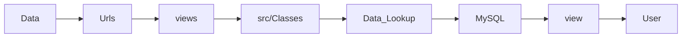

# FAF-API-ICICLE

## API access to the US Bureau of Transportation Statistics' Freight Analysis Framework dataset

As part of the NSF ICICLE AI Institute [https://icicle.osu.edu/] and in collaboration with the US Bureau of Transportation Statistics we developed an API for the Freight Analysis Framework dataset.  The API interfaces with a remote MySQL server where the data resides (called the FAF database as implemented in the `Data_Lookup.py` file located in the `src` folder at the root of the server). 

The FAF database API was developed to achieve the following objectives:

-   To prevent users from directly accessing the database, thereby safeguarding it against unauthorized modifications or manipulations.
-   To facilitate future updates by allowing modifications to the lookup tables when new data is added, rather than altering the physical queries. This approach will support automation in future development efforts.



## Accessing the API 

The API can be accessed through https://fafserver.pods.icicleai.tapis.io/api/schema/swagger-ui/#/

## Data

The API accesses the following version of the FAF dataset:

Most recent:  <fill this in>

## Setting Up Your Own Server
The retrieved values are then provided via endpoints defined in the `urls.py` and `views.py` files, both of which are housed within the `Rest_API` application. These endpoints interact with classes located at the base of the `src` directory, which are responsible for constructing queries sent to the database using the `faf_mapping.py` and `state_mapping.py` files.

It is advisable to create a Python virtual environment before installing the server dependencies. To accomplish this, execute the following command:
* For Linux & macOS users:
```python3 -m venv environment_name```
* For Windows Users:
 ```python -m venv environment_name```
 
To activate the virtual environment:
* On Linux & macOS, run:
```source environment_name/bin/activate```
* On Windows, run:
```environment_name\Scripts\activate```

After activating the environment, proceed by cloning this repository into the virtual environment.

The dependencies for the server are listed in the `requirements.txt` file, with all versions kept up to date. The server is currently using Python version 3.8.10, but any Python version up to 3.12.3 is compatible. To install the dependencies, use the following command in the root directory of the server:
```pip install -r requirements.txt```

To run the server, ensure that the Python virtual environment is activated and all dependencies listed in `requirements.txt` are installed. Once these steps are completed, navigate to the root directory of the server and execute the following command:
```python3 manage.py runserver```

For Windows users, omit the `3` from the command, so use:
```python manage.py runserver```

If you would like the server to run on a specific port, use the following command:
```python3 manage.py runserver #.#.#.#:port_number"```
for example:
```python2 manage.py runserver 0.0.0.0:12121```

The server should now be running. 

For more information on implementing endpoints or editing the project in general: [Here](DEV_README.md)

## Thanks
Thanks to colleagues at Texas Advanced Computing Center (TACC) who are hosting the FAF API as part of the NSF AI ICICLE Institute. Thanks to the US Bureau of Transportation Statistics Freight Analysis Framework for guidance.


## License
FAF API Server is developed by Indiana University and distributed under the BSD 3-Clause License. See `LICENSE` for more details.
